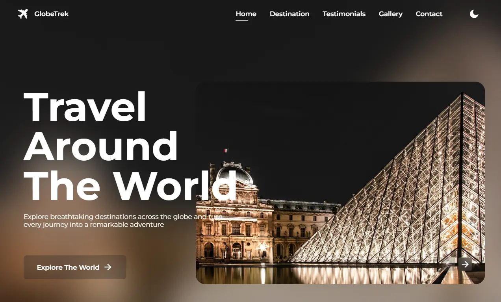

# 🌍 GlobeTrek Travel Website

A modern, responsive travel website built with **Angular 20** showcasing beautiful destinations, user testimonials, and travel experiences. Perfect for travel agencies, bloggers, or anyone looking to showcase travel content with a focus on user experience and visual appeal. [Live Demo](https://globetrek-website.netlify.app)



## ✨ Features

### 🏠 **Home Section**
Hero banner with compelling travel messaging, auto-playing image carousel with Swiper.js, smooth scroll navigation to destinations, and responsive design for all devices.

### 🗺️ **Destinations**
Beautiful destination cards with location details featuring Pyramids of Giza, Louvre Museum, and Sagrada Familia with country information, map pin icons, hover effects and smooth transitions.

### 💬 **Testimonials**
Real user reviews from travelers worldwide in an auto-playing carousel with profile information, authentic travel stories from different destinations, and smooth transitions between testimonials.

### 📸 **Gallery**
Stunning travel photography from various countries in a responsive grid layout featuring destinations from Australia, Italy, France, and Greece with location tags for each image.

### 📧 **Newsletter**
Email signup form for travel updates with engaging copy to encourage subscriptions and visual appeal with accompanying travel imagery.

### 🎨 **Design Features**
Dark/light theme toggle with persistent preference, seamless section navigation with smooth scrolling, convenient back-to-top functionality, mobile-friendly hamburger menu, and modern typography using Montserrat + Dancing Script fonts.

## 🛠️ Tech Stack

- **Angular 20**: Latest version with standalone components
- **TypeScript**: Type-safe development
- **Swiper.js**: Touch-enabled carousels
- **RemixIcon**: Comprehensive icon library
- **CSS3**: Modern styling with variables and animations

## 🚀 Quick Start

### Prerequisites
- Node.js (v16+)
- Angular CLI (`npm install -g @angular/cli`)

### Installation
```bash
# Clone and install
git clone https://github.com/sebai-dhia/globeTrek.git
cd globeTrek
npm install

# Start development server
ng serve
```

Visit `http://localhost:4200` to view the app.

## 📁 Project Structure

```
src/
├── app/
│   ├── components/        # Header, Footer, Scroll-up
│   ├── sections/          # Home, Destination, Gallery, Testimonial, Join
│   └── services/          # Theme management
├── assets/
│   ├── img/               # All project images
│   └── css/               # External CSS libraries
└── styles.css             # Global styles and variables
```

## 🌟 Key Highlights

- **Modern Angular Architecture**: Built with Angular 20 and standalone components
- **Fully Responsive**: Works perfectly on mobile, tablet, and desktop
- **Performance Optimized**: Fast loading with smooth animations
- **Accessibility**: Keyboard navigation and screen reader support
- **Theme Support**: Light and dark mode with persistent preferences
- **Professional Design**: Clean, modern UI with attention to detail

## 📱 Responsive Design

Optimized for:
- **Mobile**: 320px - 768px
- **Tablet**: 768px - 1024px  
- **Desktop**: 1024px+

## 🎯 User Experience

- **Fixed Header**: Always accessible navigation
- **Smooth Scrolling**: Seamless section transitions
- **Active Section Highlighting**: Visual feedback
- **Mobile Menu**: Collapsible navigation
- **Interactive Elements**: Hover effects and animations
- **Performance**: Optimized assets and fast loading

## 📄 License

This project is licensed under the MIT License.
